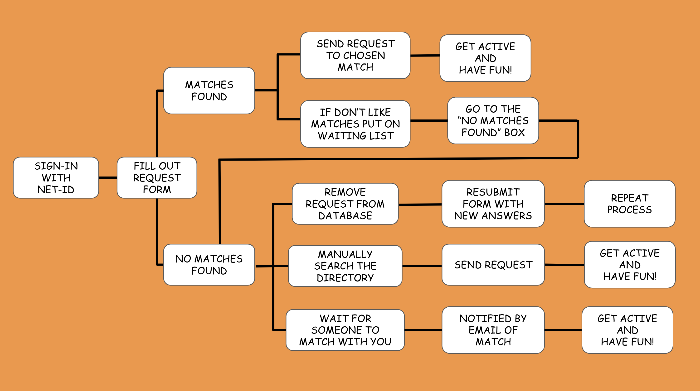

# TigerGainz
## About
This project was started in July 2020 to give Princeton University students a conveneient way to find a workout buddy during quarantine. It was developed with the COVID-19 pandemic in mind, accomdating for students who would be on or off campus. The development team is made up of four students from the class of 2024: Vinay Konuru, Elizabeth Medina, Eugene Lui, and Ben Cai. It is set to officially release for the Spring 2021 Semester. Thank you for your interest in the project and we hope you enjoy the app. Feel free to contact us with any concerns or suggestions.
# Process

On logging in, users are able to fill out a workout partner request form. Based on the fields that the user filled out, including their preferred workout type, days of the week, duration, and whether they are on or off campus, our matching algorithm looks for matches within the waiting list. The user is given the choice to choose a partner from any of the top three matches. Upon matching with a partner, both the user and the student they matched with are emailed with their partner's contact information.

If the user does not like any of the given matches or the matching algorithm didn't find any requests that were similar to the user's request, then they will be placed onto the waiting list. While on the waiting list, users can view other students' requests that are also on the waiting list and manually look for a partner. Students can also filter requests on the waiting list page to find student's with similar preferences more easily. A user can also remove themselves from the waiting list or resubmit their form.

If a user wants to end their partnership for any reason, they can delete their partner one hour of matching with them. Both the user and their partner will be contacted when the partnership is broken. 

If there's any features you'd like us to add, feel free to fill out the suggestion form on the contact page.
